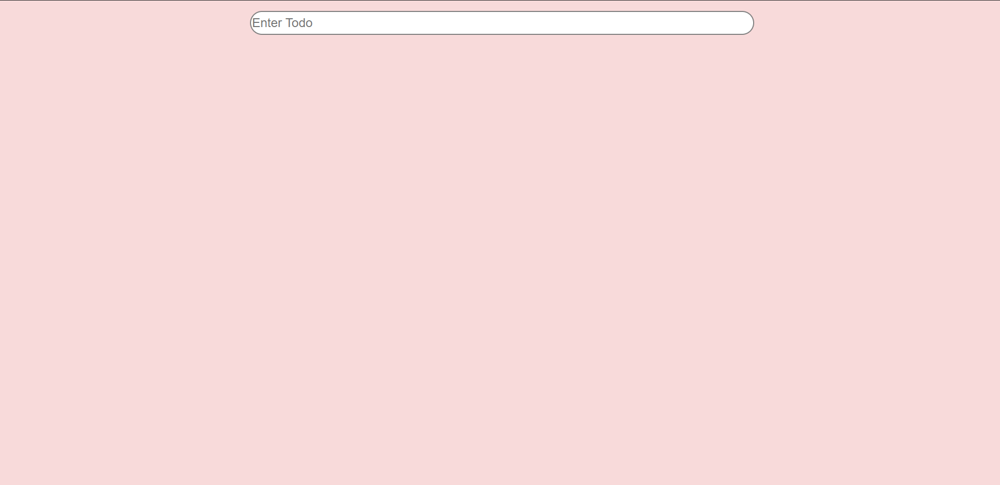
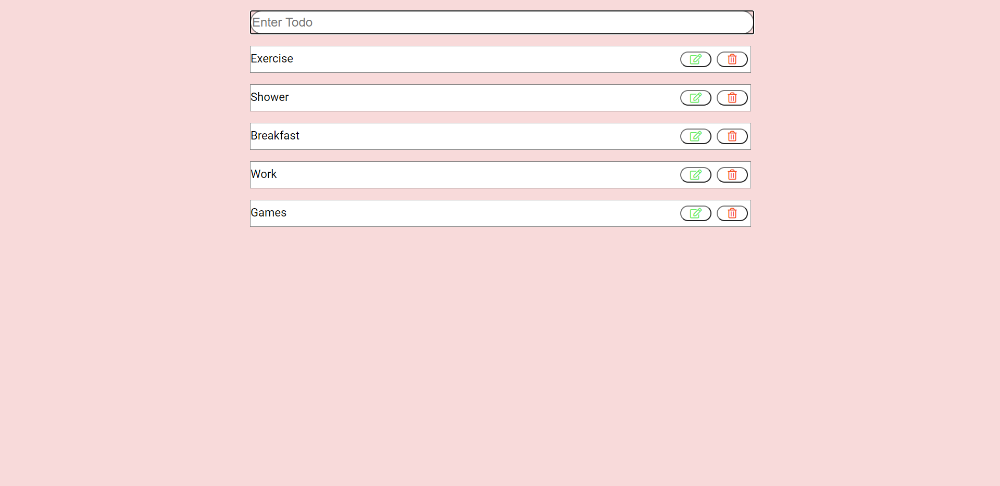
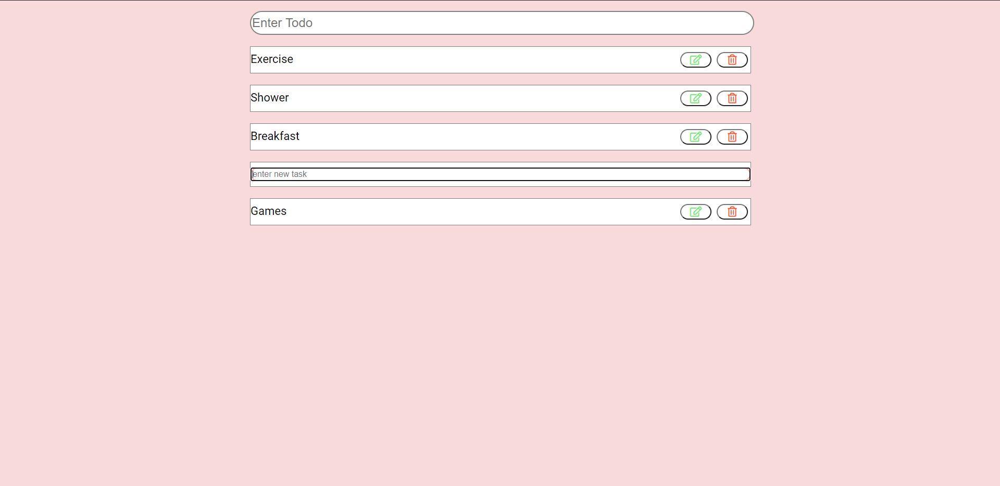
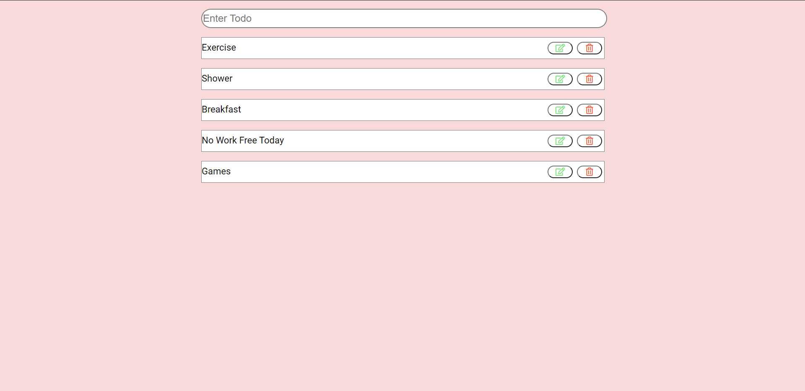
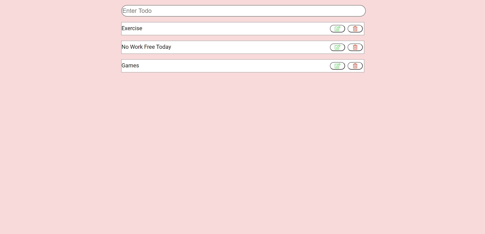

# Todo-App in React
### A Todo-App created in React with its own default state management. It stores todos in local storage and then manipulate it based on user actions.

## Add Todos
### Adding Todos which will be saved in local storage.

## Edit Todos

## Edited Todo

## Delete Todos
### You can delete todo task in any order, task will be deleted from the local storage.

